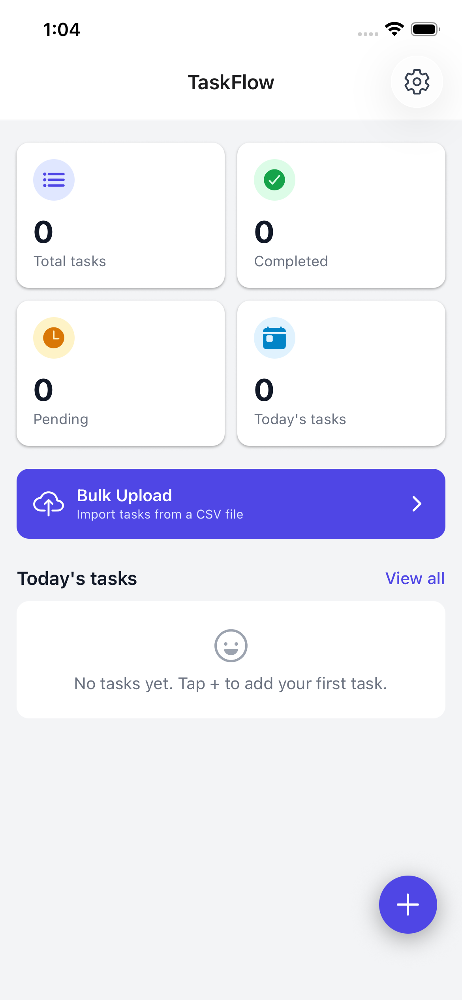
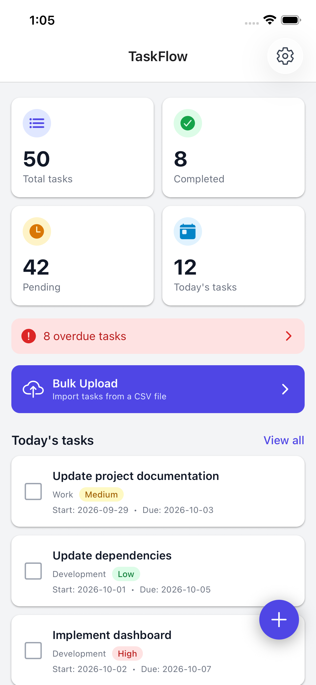
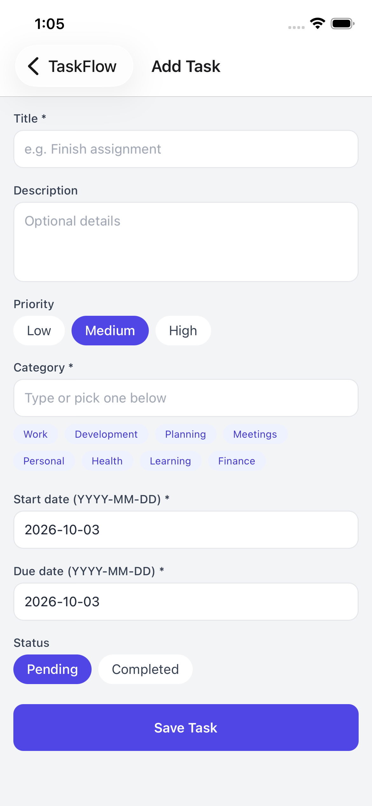
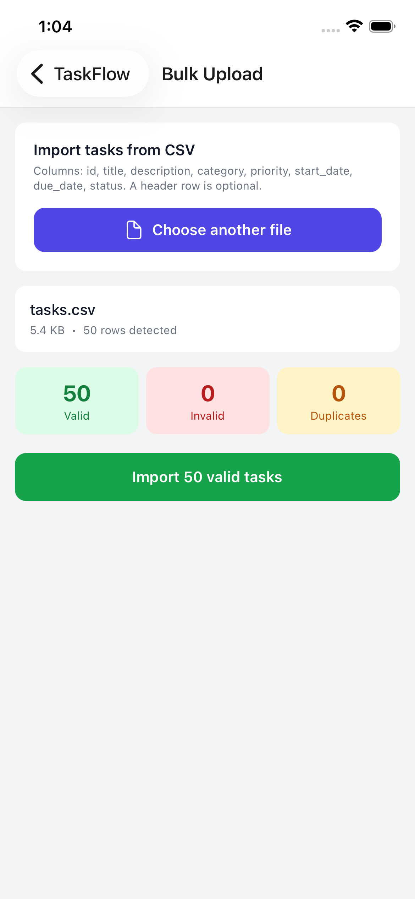
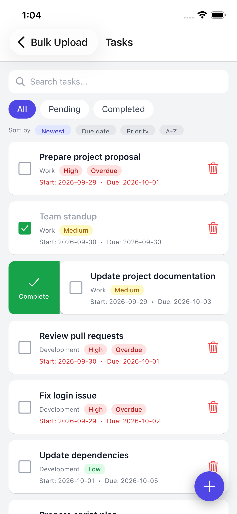
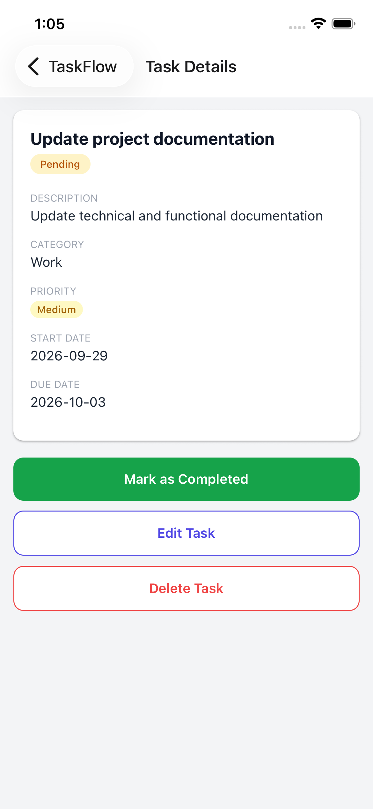
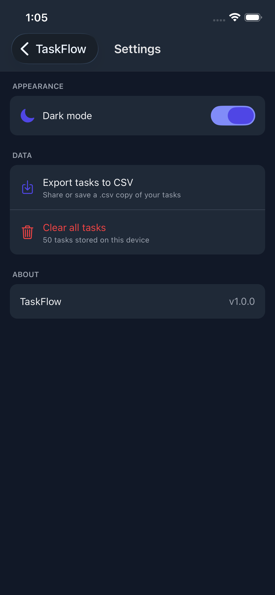

# TaskFlow

A simple task management app built with React Native and Expo. Create, edit, filter, sort and track tasks, import them in bulk from a CSV file, and export them back out. All data is stored locally on the device, so no backend or account is needed.

## Demo

- Screen recording: `link`
- Android APK: `link`

## Features

**Core**

- **Dashboard**: total, completed, pending and today's task counts, a preview of today's tasks, a floating + button, and a shortcut to Bulk Upload
- **Task list**: All / Pending / Completed filters, search (title, category, description), sorting, complete checkbox, delete with confirmation
- **Add / Edit task**: title, description, priority, category (with suggestions), start date, due date, status, inline validation (the due date cannot be earlier than the start date)
- **Task details**: full task information, mark as completed or pending, edit, delete
- **Bulk upload**: pick a CSV file, see file info, validate every row, view row-level errors, import the valid records, see an import summary, and skip duplicates
- **Settings**: dark / light mode (remembered between launches) and clear all tasks (with confirmation)
- Loading, empty and error states on the screens that need them

**Bonus**

- Overdue indicator (badge on cards and details, plus a banner on the dashboard)
- Sorting by newest, due date, priority and title
- Swipe actions on the task list (swipe right to complete, swipe left to delete)
- Export tasks to CSV through the system share sheet
- Dark mode

## Tech stack

| Area | Choice |
| --- | --- |
| Framework | React Native with Expo (JavaScript) |
| Navigation | React Navigation (native stack) |
| Styling | NativeWind (Tailwind CSS for React Native) |
| State management | React Context (`TaskContext`, `ThemeContext`) |
| Local storage | `@react-native-async-storage/async-storage` |
| CSV parsing and export | `papaparse` |
| File picking and sharing | `expo-document-picker`, `expo-file-system`, `expo-sharing` |
| Gestures | `react-native-gesture-handler`, `react-native-reanimated` |

## Project structure

```
App.js                      Providers + navigation setup
src/
  components/               Reusable UI (TaskCard, SwipeableTaskCard, StatCard,
                            PriorityBadge, OverdueBadge, FormField, OptionSelector)
  context/                  TaskContext (tasks + persistence), ThemeContext
  screens/                  Dashboard, TaskList, AddEditTask, TaskDetails,
                            BulkUpload, Settings
  services/                 csvService (parse + validate), fileService (read files),
                            exportService (CSV export)
  utils/                    constants, dateUtils, validators
```

**How data flows:** `TaskContext` keeps the task list in React state and saves it to AsyncStorage whenever it changes. Screens read tasks and call actions (`addTask`, `updateTask`, `deleteTask`, `toggleComplete`, `importTasks`, `clearAllTasks`) through the `useTasks()` hook. Validation and CSV logic live in plain functions outside the UI so they can be reused (the CSV import uses the same `validateTask` as the form).

## Getting started

**Prerequisites:** Node.js 18 or newer, npm, and either the Expo Go app on an Android phone or an Android emulator.

```bash
git clone https://github.com/amarjec/taskflow-app.git
cd taskflow-app
npm install
npx expo start
```

Then scan the QR code with Expo Go, or press `a` to open an Android emulator.

If styles look wrong after pulling changes, restart with a clean cache: `npx expo start -c`.

## Building the APK

The APK is built in the cloud with [EAS Build](https://docs.expo.dev/build/introduction/):

```bash
npm install -g eas-cli
eas login
eas build -p android --profile preview
```

When the build finishes, download the `.apk` from the link EAS prints and install it on an Android device (you may need to allow installs from unknown sources).

## CSV import format

Columns, in this order:

```
id,title,description,category,priority,start_date,due_date,status
```

Rules:

- The header row is **optional**. If the first row contains the column names, they are used; otherwise the columns are read in the order above.
- `title` and `category` are required.
- `priority` must be `Low`, `Medium` or `High` (case-insensitive).
- `status` must be `pending` or `completed` (case-insensitive; `todo`, `complete` and `done` are also accepted).
- Dates must be `YYYY-MM-DD`, and `due_date` must not be earlier than `start_date`.

### How validation and duplicates are handled

1. The file is validated **before** anything is imported. The screen shows how many rows are valid, invalid and duplicate.
2. Invalid rows are listed with their row number and the reason. Row numbers count data rows (a header row is not counted). Invalid rows are skipped, and valid rows can still be imported.
3. A row is a **duplicate** if its `id` already exists in the app or earlier in the same file, or if its title, start date and due date match an existing task (case-insensitive). Duplicates are skipped, not overwritten.
4. Importing the same file twice therefore adds nothing the second time.

Exported files use the same format (with a header row), so an export can be imported again.

## Incomplete features

- Calendar-based task filtering (a listed bonus) is not implemented.
- There is no date picker. Dates are typed as `YYYY-MM-DD` and validated.
- There is no category filter on the task list (category is searchable, and shown on each card).
- No automated tests.

## Known issues

- On startup, the saved dark-mode preference loads a moment after the first render, so the app can flash light before switching to dark.
- In Expo Go on Android, reading a picked CSV file can fail because of a known Expo Go limitation. The app tries several read methods, and the installed APK is the most reliable way to use Bulk Upload.
- "Today's tasks" means tasks whose start-to-due range includes today (the assignment does not define it).
- Swipe actions reveal buttons that you tap, rather than triggering automatically when you release.
- The Add / Edit form does not warn about unsaved changes when you leave it.
- Data is stored only on the device. Use Export to CSV to keep a backup.

## Screenshots

<p align="center">
  <!--  -->
  
  
  <!--  -->
  
  <!--  -->
  
</p>


## Author

Amar Agrawal